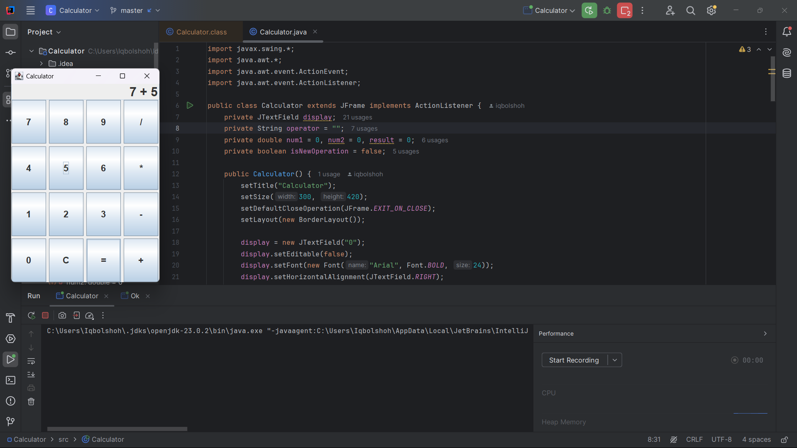

# 🧮 Java Calculator App 

  

## 📌 Overview 📝  
This is a simple **Java-based Calculator** built using `Swing` 🏗️ for the graphical user interface (GUI). The calculator supports **basic arithmetic operations** ➕➖✖️➗.  

## 🎯 Features 🌟  
✅ **User-Friendly Interface** – Responsive buttons 🎛️ and a clean design 🧼.  
✅ **Basic Arithmetic Operations** – Supports `+`, `-`, `*`, and `/` 🧮.  
✅ **Clear Function (`C`)** – Resets the display and stored values ♻️.  
✅ **Result Calculation (`=`)** – Computes the entered mathematical expression 🏆.  
✅ **Error Handling** – Prevents division by zero ❌➗0.  

## 🚀 How to Run 🏃💨  
1️⃣ **Clone the Repository** 📂:  
   ```bash
   git clone https://github.com/iqbolshoh/java-calculator-app.git  
   cd java-calculator-app  
   ```
2️⃣ **Compile the Program** 🔧:  
   ```bash
   javac Calculator.java  
   ```
3️⃣ **Run the Application** 🎯:  
   ```bash
   java Calculator  
   ```

## 💡 Usage 🏗️  
🔢 Click on the numeric buttons (`0-9`) to enter numbers.  
➕➖✖️➗ Use arithmetic operator buttons (`+`, `-`, `*`, `/`) to perform operations.  
✅ Press `=` to compute the result.  
♻️ Click `C` to reset the calculator.  

## 🖥 Technologies Used

<div style="display: flex; flex-wrap: wrap; gap: 5px;">
    
    
    
</div>

## 📜 License
This project is open-source and available under the **MIT License**.

## 🤝 Contributing  
🎯 Contributions are welcome! If you have suggestions or want to enhance the project, feel free to fork the repository and submit a pull request.

## 📬 Connect with Me  
💬 I love meeting new people and discussing tech, business, and creative ideas. Let’s connect! You can reach me on these platforms:

<div align="center">
  <table>
    <tr>
      <td>
        <a href="https://iqbolshoh.uz" target="_blank">
          
        </a>
      </td>
      <td>
        <a href="mailto:iilhomjonov777@gmail.com" target="_blank">
          
        </a>
      </td>
      <td>
        <a href="https://github.com/iqbolshoh" target="_blank">
          
        </a>
      </td>
      <td>
        <a href="https://www.linkedin.com/in/iqbolshoh/" target="_blank">
          
        </a>
      </td>
      <td>
        <a href="https://t.me/iqbolshoh_777" target="_blank">
          
        </a>
      </td>
      <td>
        <a href="https://wa.me/998997799333" target="_blank">
          
        </a>
      </td>
      <td>
        <a href="https://instagram.com/iqbolshoh_777" target="_blank">
          
        </a>
      </td>
      <td>
        <a href="https://x.com/iqbolshoh_777" target="_blank">
          
        </a>
      </td>
      <td>
        <a href="https://www.youtube.com/@Iqbolshoh_777" target="_blank">
          
        </a>
      </td>
    </tr>
  </table>
</div>
